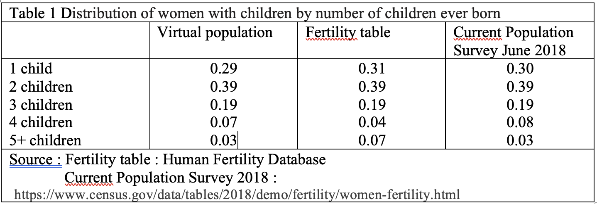

## Introduction

A simulation is considered valid if the simulated (virtual) population is sufficiently close to the real population being simulated. The validity of the model depends on the data, the model and the assumptions. To assess the validity of the simulation, summary indicators of the virtual population are compared to empirical indicators. They may also be compared to model outcomes, such as measures produced by life table and the period fertility tables. Note that the fertility table disregards the effect of mortality, and a census or survey covers survivors at Census Day or survey date. The assessment should account for these peculiarities. 

For validity analysis, the virtual population should be sufficiently large to limit the effect of chance. A virtual population of 10,000 individuals is used.  

## Validity

The mean age at death in the virtual population based on the United States death rates of 2019 is 81.77 for females and 75.95mean for males. The figures are close to the period life expectancy reported in the HMD: 81.72 for females and 76.59 for males. Differences are due to method used and chance. Note that the survival function in the simulation is a piecewise exponential function, whereas in the conventional life table calculations it is a piecewise linear function. The difference is negligible if mortality rates are small. The latter approach is also used in the HMD [@wilmoth2021methods, p. 36].

To compare number of children in the virtual population with the figures reported in the period fertility table, the effects of mortality should be removed. To remove mortality, the variable $x\_D$ in $dataLH$ is set to an age beyond the end of the reproductive period, e.g. 85, which is done by specifying the argument $iages$ in the $GetGenerations$ function (see $Tutorial$). In the absence of mortality, a woman in the virtual population (generation 1) has 1.706 children, on average, comparable to the total fertility rate (TFR) of 1.715 reported in the period fertility table. The TFR in 2019 reported by the National Center for Health Statistics was 1.706 [@martin2021births]. In the presence of mortality, women in the virtual population have 1.670 children, on average. The proportion of women remaining childless is 23.23 percent, higher than the 20.98 percent in the period fertility table. Table 1 shows the distribution of women with children by number of children ever born. The distributions in the virtual population and the fertility table are close. The difference can be attributed to the effect of mortality and the method used to compute probabilities from rates. Consider the fertility rate of childless women aged 32. The rate is 0.10119. The probability of having a first child within a year is m/(1+0.5m)=0.10119/(1+0.5*0.10119)=0.09632. In the exponential model, the probability is 1-exp[-m]=1-exp[-0.10119]=0.09624. An exponential survival function with constant rate implies a lower transition probability than a linear survival function with uniform distribution of events. The cumulative effect over all ages is a higher childlessness in the piecewise exponential model than in the piecewise linear model. 

An unexpected finding is that the distribution of women with children by number of children ever born is also similar to that recorded in the Current Population Survey (CPS) 2018. The result is unexpected because the CPS records the number of children ever born by age of mother at survey date (June 2018). 


```{r out.width = '80%'}

```

As an additional validity check, the distribution of number of children ever born, by age of the mother, in the virtual population is compared with the distribution observed in the CPS of June 2018. The following table shows the number of children ever born, by age of mother, observed by CPS at survey date. The numbers are given for 5-year age groups from 15 to 50. A total of 76,413 women are included in the CPS in June 2018, 13.5 percent was 15-19 years of age at time of survey, 13.9 percent was 20-24, etc. Of those aged 15-19, 96.9 percent had no children at survey date, 2.1 percent has 1 child and 0.8 percent has 2 children. Of those 45-50 at survey, 15.4 percent are childless. More than one third (35.5 percent) has two children.  

```{r echo=FALSE}
# ===============  Number of children ever born  CPS June 2018    Women, by age   =================
# https://www.census.gov/data/tables/2018/demo/fertility/women-fertility.html#par_list_57
#   table t1.xlsx
nfemCPS <- c(10294,10607,11476,10889,10727, 9896,12524 )
# round (100 *nfemCPS/sum(nfemCPS),2)
#     44.2 percent have 0 children
# 15 to 50 years 
everBorn <- matrix (c(96.9,2.1,0.8,0.1,0,0.1,0,
  78.6,14,6,1,0.3,0.2,0,
  54.2,20.4,16.2,6.5,2.1,0.5,0.1,
  33.6,22.3,24.6,12.8,4.4,1.9,0.3,
  20.0,19.2,32.6,17.4,7.3,3.2,0.4,
  15,18.7,34.6,18.6,8.7,3.8,0.7,
  15.4,19.8,35.4,17.3,7.4,3.6,1.2),nrow=7,byrow=TRUE)
everBornTot <- c(44.2,16.8,21.7,10.7,4.3,1.9,0.4)

d <- rbind (everBorn,Allages=everBornTot)
d <- cbind (Females=c(nfemCPS,sum(nfemCPS)),d)
nbreaks <- c(15,20,25,30,35,40,45,50)
namagegroup <- vector(mode="character",length=7)
for (i in 1:6)
{ namagegroup[i] <- paste (nbreaks[i],"-",nbreaks[i+1]-1,sep="")
}
namagegroup[7] <- paste (nbreaks[i+1],"-",nbreaks[i+2],sep="")
dimnames(d) <- list (AgeGroup=c(namagegroup,"Total"),
           Number_of_children_ever_born_CPS=c("nfemales",0,1,2,3,4,"5-6","7-8"))
d
```
Source: https://www.census.gov/data/tables/2018/demo/fertility/women-fertility.html#par_list_57

To obtain comparable figures, respondents in the CPS and individuals in the virtual population should be followed during the same segments of life. To meet that requirement, the female members of the first generation are selected, the competing risk of death is omitted, and the CPS censoring scheme is imposed onto the virtual population. In the CPS 2018, 13.5 percent of repondents are interviewed at an age between 15 and 20. 13.9 percent at an age between 20 and 25, etc. The age of interview is the age at censoring. The same age distribution of censoring is imposed onto the virtual population. Individuals are assigned an age group at censoring randomly by sampling a multinomial distribution with parameters the probability distribution of respondents in the CPS of June 2018. The exact ages at censoring are obtained by assuming a uniform age distribution within a 5-year age interval. The exact age at censoring (interview) is obtained by sampling the uniform distribution with minimum value 0 and maximum value 5 and adding the result to the minimum age of the selected age group. Once the exact age at censoring is known, the calendar date of censoring is adjusted. The following code implements the procedure: 

```{r}
library (VirtualPop)
dataLH <- NULL
data(dataLH)
# load("/Users/frans/Documents/R/0 0 MAC/Simul_ABM/HMD_HFD+paper/R/dataUSA2019.RData") # !!!!!!!!!!!!!!
rates <- NULL
data(rates)
dataLH1 <- subset(dataLH,dataLH$gen==1 & dataLH$sex=="Female")

# Replace x_D by age distribution of women at CPS June 2018 (males 85)
nfemCPS <- c(10294,10607,11476,10889,10727, 9896,12524 )
perc <- nfemCPS/sum(nfemCPS)
nbreaks <- c(15,20,25,30,35,40,45,50)
nfemales0 <- length(dataLH1$ID[dataLH1$sex=="Female"])
# ages <- as.numeric(rownames(poprefyear_distrib))
dataLH1$x_D[dataLH1$sex=="Female"] <- sample (nbreaks[1:(length(nbreaks)-1)],nfemales0,prob=perc,replace=TRUE) + runif(nfemales0,min=0,max=5)
dataLH1$x_D[dataLH1$sex=="Male"] <- 85
# Adjust the calendar date of censoring
dataLH1$ddated <- dataLH1$bdated + dataLH1$x_D
dataLH1 <- dataLH1[,1:which (colnames(dataLH1)=="nch")]
dataLH1$nch <- NA
```

To assesses whether the age distribution at censoring in the virtual population is the same as the age distribution at CPS survey, use the following code chunk:

```{r}
# Age distribution at censoring in the virtual population
age_interview_VirtualPopulation <- cut (dataLH1$x_D[dataLH$sex=="Female"],breaks=nbreaks,include.lowest=TRUE,labels=namagegroup)
nfem0 <- table (age_interview_VirtualPopulation)
round (100 * nfem0/sum(nfem0),2)
```
```{r echo=FALSE}
# Age distribution of respondents at survey date, CPS 2018
cat("age_CPS")
names(perc) <- names(nfem0)
round (100*perc,2)
```

The number of females in the virtual population of 10,000 individuals is `r nrow(dataLH1)`. The age $dataLH1\$x\_D$ is the age at censoring. 

The next step is to simulate individual fertility careers between the minimum reproductive age, which is 15 in the CPS data, and the ages at censoring:

```{r warning=FALSE}
ech <- Children (dataLH1,rates)
dataLH2 <- ech$data
dataLH1 <- dataLH2
```

In the following code, numbers of children ever born at censoring date are computed.

```{r}
# Select ages of mothers at childbirth from dataLH1 and convert ages to age groups
namages <- c("x_D","age.1","age.2","age.3","age.4","age.5","age.6","age.7","age.8","age.9")
ww <- subset (dataLH1[,c(6,21:29)],dataLH1$sex=="Female")
# names <- c("0-19","20-24","25-29","30-34","35-39","40+")
ww2 <- cut (data.matrix(ww),breaks=nbreaks,include.lowest=TRUE,labels=namagegroup)
ww3 <- matrix(ww2,ncol=10)
colnames(ww3) <- namages

# For each age group at censoring, compute number of children born, by birth order (object nch),
# the number of children ever born ( object nchever),
# and the probability distribution of numbers of children ever born, by age group at censoring (vaiable ncheverPerc)
nch <- nchever <- ncheverPerc <- matrix (nrow=7,ncol=12)
for (i in 1:7)
{ zz <- subset (ww3,ww3[,1]==namagegroup[i])
  nch[i,c(1,4:ncol(nch))] <- apply(zz,2,function(x) length(x[!is.na(x)]))
  nchever[i,4:ncol(nchever)]  <-  - c(diff(nch[i,4:ncol(nchever)]),0)                                                  
}    
nch[,2] <- rowSums(nch[,4:ncol(nch)])
dimnames(nch) <- list (AgeGroup=c(namagegroup),
           nch=c("nfemales","nch",0:9))
nchever[,1:2] <- nch[,1:2]
nchever[,3] <- nchever[,1] - rowSums(nchever[,4:ncol(nch)])
dimnames(nchever) <- dimnames(nch)
ntab <- addmargins (nchever,margin=1)
ncheverPerc <- ntab
ncheverPerc[,3:ncol(nchever)] <- round (100*proportions (ntab[,3:ncol(nchever)],margin=1),1)
names(dimnames(ncheverPerc))[2] <- "Number_of_children_ever_born_VirtualPopulation"
```

The distribution of numbers of children ever born, by age group at censoring, is shown in the following table.
```{r}
ncheverPerc
```
The results of the simulation are remarkably close to the observed figures. The simulated and observed distributions of number of children ever born differ for two reasons. First and foremost, the number recorded in the CPS is the outcome of a history of varying demographic rates. In the CPS, respondents at an early stage of the reproductive career (young ages at survey) have different age- and parity-specific rates than old respondents in a similar stage of the reproductive career. The two generations experience the first stage of the reproductive career in historical contexts with different social and economic conditions. The young generation is in the early stage around the survey date of 2018, whereas the older generation was in the early stage many years ago. In the virtual population, the effect of historical context is missing. Age- and parity-specific fertility rates are constant rates collected during a single calendar year (reference year 2019). The second reason is the effect of sampling. 

Differences between numbers of children ever born in the virtual population and the CPS data would be much larger if the simulation did not account for the censoring of observations in the CPS. The relative closeness of the figures in the virtual population and the CPS survey shows the power of simulation and the computational approach. It also justifies the use of virtual populations to gain insight into demographic processes.

## References


